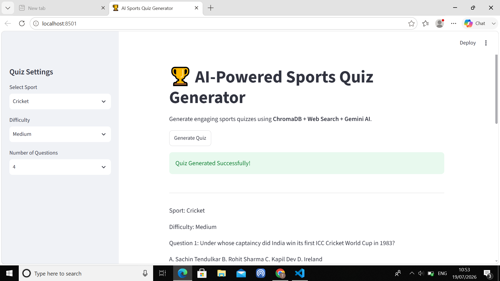

# AI-Powered Sports Quiz Generation Agent

## Overview

The AI-Powered Sports Quiz Generation Agent is a Retrieval-Augmented Generation (RAG) application that generates engaging and factually accurate sports quizzes.

The application combines:

- ChromaDB Vector Database (Historical Sports Facts)
- DuckDuckGo Web Search (Latest Sports Information)
- Google Gemini API (Quiz Generation)
- Streamlit (Interactive Dashboard)

The generated quizzes are suitable for social media engagement and educational purposes.

---

## Features

- Select a sport
- Choose difficulty level (Easy, Medium, Hard)
- Generate 4–5 multiple-choice quiz questions
- Four answer options (A, B, C, D)
- Correct answer
- Explanation for each answer
- Regenerate new quizzes
- Retrieval-Augmented Generation (RAG)
- ChromaDB knowledge retrieval
- Live web search integration
- Interactive Streamlit dashboard

---

## Tech Stack

- Python
- Streamlit
- ChromaDB
- Sentence Transformers
- DuckDuckGo Search
- Google Gemini API
- python-dotenv

---

## Project Structure

```
Sports-Quiz-Agent/

│── app.py
│── requirements.txt
│── README.md
│── .env

│── data/
│   └── sports_facts.json

│── chroma_db/

│── src/
│   ├── config.py
│   ├── database.py
│   ├── generator.py
│   └── search.py

│── test_database.py
│── test_generator.py
│── test_models.py
│── test_search.py
```

---

## How It Works

1. User selects:

   - Sport
   - Difficulty Level

2. ChromaDB retrieves historical sports facts.

3. DuckDuckGo retrieves recent sports information.

4. Retrieved information is combined into a single prompt.

5. Gemini AI generates:

   - Multiple-choice questions
   - Four options
   - Correct answer
   - Explanation

6. Streamlit displays the generated quiz.

---

## RAG Workflow

```
User Input
     │
     ▼
Select Sport & Difficulty
     │
     ▼
Retrieve Historical Facts
(ChromaDB)
     │
     ▼
Retrieve Latest Sports News
(DuckDuckGo Search)
     │
     ▼
Combine Retrieved Context
     │
     ▼
Gemini AI
     │
     ▼
Generate Sports Quiz
     │
     ▼
Display Quiz in Streamlit
```

---

## Installation

### Clone the repository

```bash
git clone YOUR_GITHUB_LINK
cd Sports-Quiz-Agent
```

### Create Virtual Environment

Windows

```bash
python -m venv venv
venv\Scripts\activate
```

Linux / macOS

```bash
python3 -m venv venv
source venv/bin/activate
```

### Install Dependencies

```bash
pip install -r requirements.txt
```

---

## Configure API Key

Create a `.env` file in the project root.

```
GEMINI_API_KEY=YOUR_API_KEY
```

---

## Populate ChromaDB

```bash
python test_database.py
```

---

## Test Web Search

```bash
python test_search.py
```

---

## Test Quiz Generation

```bash
python test_generator.py
```

---

## Run the Application

```bash
streamlit run app.py
```

---

## Sample Output

Sport: Cricket

Difficulty: Medium

Question:

Who captained India to its first ICC Cricket World Cup victory?

A. Sunil Gavaskar

B. Kapil Dev

C. MS Dhoni

D. Rahul Dravid

Correct Answer:

Kapil Dev

Explanation:

Kapil Dev captained India to its first ICC Cricket World Cup victory in 1983.

---

## Technologies Used

- Python
- Streamlit
- ChromaDB
- Google Gemini
- DuckDuckGo Search
- Sentence Transformers
- dotenv

---

## Future Improvements

- Add more sports knowledge to ChromaDB
- Display quiz in card format
- Export quizzes as PDF
- Save quiz history
- Support image-based sports quizzes

---

## Author

Tejashree S P

AI Product Engineer Intern Assignment

## Application Preview



## License

This project was developed as part of the AI Product Engineer Intern Assignment for educational and evaluation purposes.